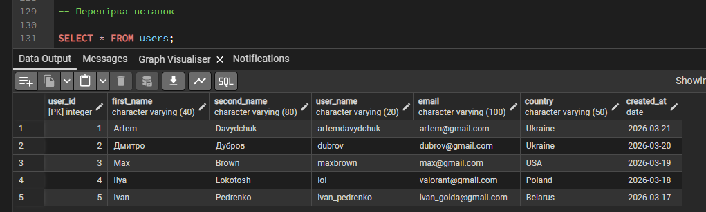
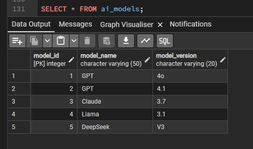
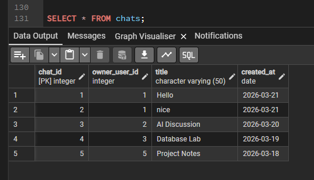
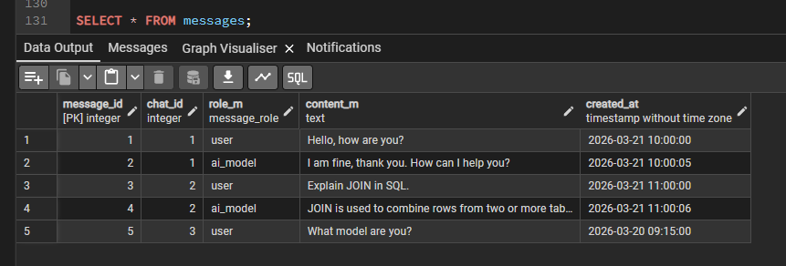
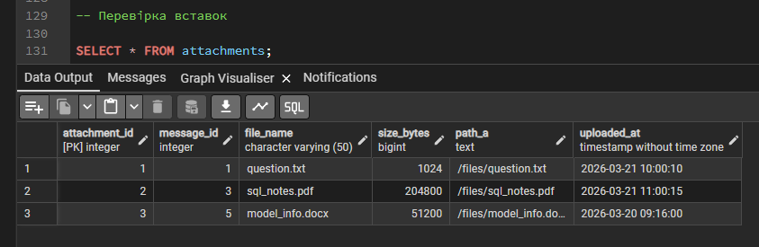
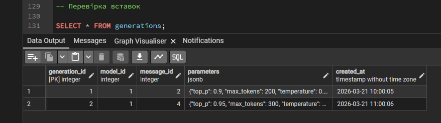
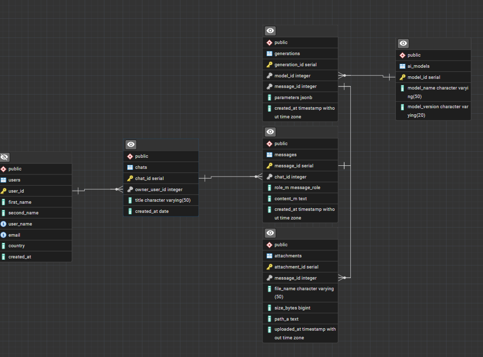

# Лабораторна робота №2

**Тема:** Перетворення ER-діаграми на схему PostgreSQL  
**Виконав:** Давидчук Артем, група ІО-41

## Мета роботи
Перетворити ER-діаграму, побудовану в попередній лабораторній роботі, на реляційну схему бази даних у PostgreSQL, реалізувати її засобами SQL та заповнити таблиці тестовими даними.

## Вихідні дані
Основою для побудови реляційної схеми є ER-діаграма предметної області, отримана в попередній лабораторній роботі.

## Побудована схема бази даних
На основі ER-діаграми було реалізовано шість таблиць:
- `users` — користувачі системи;
- `ai_models` — моделі штучного інтелекту;
- `chats` — чати користувачів;
- `messages` — повідомлення в межах чатів;
- `attachments` — вкладення до повідомлень;
- `generations` — параметри генерацій відповідей моделі.

Для забезпечення цілісності даних використано:
- первинні ключі `PRIMARY KEY`;
- зовнішні ключі `FOREIGN KEY`;
- обмеження `NOT NULL`, `UNIQUE`, `CHECK`;
- перелічуваний тип `message_role` для атрибута ролі повідомлення;
- тригер `trg_check_generation_message_role`, який перевіряє, що запис у таблиці `generations` може посилатися лише на повідомлення з роллю `ai_model`.

Крім того, поле `parameters` у таблиці `generations` реалізовано як `JSONB`, оскільки параметри генерації мають напівструктуровану природу та можуть містити набір ключів на кшталт `temperature`, `max_tokens`, `top_p`.

## Характеристика таблиць

**Таблиця `users`** містить інформацію про користувачів.  
Поля: `user_id`, `first_name`, `second_name`, `user_name`, `email`, `country`, `created_at`.  
Первинний ключ: `user_id`.  
Додаткові обмеження: `user_name` та `email` є унікальними.

**Таблиця `ai_models`** містить дані про моделі штучного інтелекту.  
Поля: `model_id`, `model_name`, `model_version`.  
Первинний ключ: `model_id`.

**Таблиця `chats`** описує створені користувачами чати.  
Поля: `chat_id`, `owner_user_id`, `title`, `created_at`.  
Первинний ключ: `chat_id`.  
Зовнішній ключ: `owner_user_id` → `users(user_id)`.

**Таблиця `messages`** містить повідомлення в чатах.  
Поля: `message_id`, `chat_id`, `role_m`, `content_m`, `created_at`.  
Первинний ключ: `message_id`.  
Зовнішній ключ: `chat_id` → `chats(chat_id)`.  
Поле `role_m` може набувати лише значень `user` або `ai_model`.

**Таблиця `attachments`** містить вкладення повідомлень.  
Поля: `attachment_id`, `message_id`, `file_name`, `size_bytes`, `path_a`, `uploaded_at`.  
Первинний ключ: `attachment_id`.  
Зовнішній ключ: `message_id` → `messages(message_id)`.

**Таблиця `generations`** містить інформацію про генерації відповідей моделі.  
Поля: `generation_id`, `model_id`, `message_id`, `parameters`, `created_at`.  
Первинний ключ: `generation_id`.  
Зовнішні ключі: `model_id` → `ai_models(model_id)`, `message_id` → `messages(message_id)`.  
Додаткові обмеження: `message_id` є унікальним, а `parameters` має бути JSON-об'єктом.

## SQL-скрипт реалізації
```sql
-- Основний скелет

CREATE TYPE message_role AS ENUM ('user', 'ai_model');

CREATE TABLE users (
    user_id SERIAL PRIMARY KEY,
    first_name VARCHAR(40) NOT NULL,
    second_name VARCHAR(80) NOT NULL,
    user_name VARCHAR(20) NOT NULL UNIQUE,
    email VARCHAR(100) NOT NULL UNIQUE,
    country VARCHAR(50) NOT NULL,
    created_at DATE NOT NULL
);

CREATE TABLE ai_models (
    model_id SERIAL PRIMARY KEY,
    model_name VARCHAR(50) NOT NULL,
    model_version VARCHAR(20) NOT NULL
);

CREATE TABLE chats (
    chat_id SERIAL PRIMARY KEY,
    owner_user_id INTEGER NOT NULL REFERENCES users(user_id),
    title VARCHAR(50) NOT NULL DEFAULT 'chat',
    created_at DATE NOT NULL
);

CREATE TABLE messages (
    message_id SERIAL PRIMARY KEY,
    chat_id INTEGER NOT NULL REFERENCES chats(chat_id),
    role_m message_role NOT NULL,
    content_m TEXT,
    created_at TIMESTAMP NOT NULL
);

CREATE TABLE attachments (
    attachment_id SERIAL PRIMARY KEY,
    message_id INTEGER NOT NULL REFERENCES messages(message_id),
    file_name VARCHAR(50) NOT NULL,
    size_bytes BIGINT NOT NULL,
    path_a TEXT NOT NULL,
    uploaded_at TIMESTAMP NOT NULL
);

CREATE TABLE generations (
    generation_id SERIAL PRIMARY KEY,
    model_id INTEGER NOT NULL REFERENCES ai_models(model_id),
    message_id INTEGER NOT NULL UNIQUE REFERENCES messages(message_id),
    parameters JSONB NOT NULL CHECK (jsonb_typeof(parameters) = 'object'),
    created_at TIMESTAMP NOT NULL
);

CREATE OR REPLACE FUNCTION check_generation_message_role()
RETURNS TRIGGER AS $$
BEGIN
    IF NOT EXISTS (
        SELECT 1
        FROM messages
        WHERE message_id = NEW.message_id
          AND role_m = 'ai_model'
    ) THEN
        RAISE EXCEPTION 'Generation can reference only ai_model messages';
    END IF;

    RETURN NEW;
END;
$$ LANGUAGE plpgsql;

CREATE TRIGGER trg_check_generation_message_role
BEFORE INSERT OR UPDATE ON generations
FOR EACH ROW
EXECUTE FUNCTION check_generation_message_role();

INSERT INTO users (first_name, second_name, user_name, email, country, created_at)
VALUES
    ('Artem', 'Davydchuk', 'artemdavydchuk', 'artem@gmail.com', 'Ukraine', '2026-03-21'),
    ('Дмитро', 'Дубров', 'dubrov', 'dubrov@gmail.com', 'Ukraine', '2026-03-20'),
    ('Max', 'Brown', 'maxbrown', 'max@gmail.com', 'USA', '2026-03-19'),
    ('Ilya', 'Lokotosh', 'lol', 'valorant@gmail.com', 'Poland', '2026-03-18'),
    ('Ivan', 'Pedrenko', 'ivan_pedrenko', 'ivan_goida@gmail.com', 'Belarus', '2026-03-17');

INSERT INTO ai_models (model_name, model_version)
VALUES
    ('GPT', '4o'),
    ('GPT', '4.1'),
    ('Claude', '3.7'),
    ('Llama', '3.1'),
    ('DeepSeek', 'V3');

INSERT INTO chats (owner_user_id, title, created_at)
VALUES
    (1, 'Hello', '2026-03-21'),
    (1, 'Nice', '2026-03-21'),
    (2, 'AI Discussion', '2026-03-20'),
    (3, 'Database Lab', '2026-03-19'),
    (5, 'Project Notes', '2026-03-18');

INSERT INTO messages (chat_id, role_m, content_m, created_at)
VALUES
    (1, 'user', 'Hello, how are you?', '2026-03-21 10:00:00'),
    (1, 'ai_model', 'I am fine, thank you. How can I help you?', '2026-03-21 10:00:05'),
    (2, 'user', 'Explain JOIN in SQL.', '2026-03-21 11:00:00'),
    (2, 'ai_model', 'JOIN is used to combine rows from two or more tables', '2026-03-21 11:00:06'),
    (3, 'user', 'What model are you?', '2026-03-20 09:15:00');

INSERT INTO attachments (message_id, file_name, size_bytes, path_a, uploaded_at)
VALUES
    (1, 'question.txt', 1024, '/files/question.txt', '2026-03-21 10:00:10'),
    (3, 'sql_notes.pdf', 204800, '/files/sql_notes.pdf', '2026-03-21 11:00:15'),
    (5, 'model_info.docx', 51200, '/files/model_info.docx', '2026-03-20 09:16:00');

INSERT INTO generations (model_id, message_id, parameters, created_at)
VALUES
    (1, 2, '{"temperature": 0.7, "max_tokens": 200, "top_p": 0.9}', '2026-03-21 10:00:05'),
    (1, 4, '{"temperature": 0.5, "max_tokens": 300, "top_p": 0.95}', '2026-03-21 11:00:06');
```

## Перевірка заповнення таблиць
Після створення таблиць та додавання тестових записів виконано перевірку вмісту таблиць за допомогою запитів виду:

```sql
SELECT * FROM users;
SELECT * FROM ai_models;
SELECT * FROM chats;
SELECT * FROM messages;
SELECT * FROM attachments;
SELECT * FROM generations;
```













Також продемонструємо згенеровану ERD на основі моєї бази даних (згенерована за допомогою інструмента в pgAdmin):



## Висновок
У ході виконання лабораторної роботи ER-діаграму предметної області було успішно перетворено на реляційну схему бази даних у PostgreSQL. Було створено таблиці, визначено ключі та обмеження цілісності, реалізовано тригерну перевірку для таблиці `generations`, а також додано тестові записи до кожної таблиці. Отримана схема відповідає заданій ER-моделі та може використовуватися як основа для подальшої роботи з базою даних.