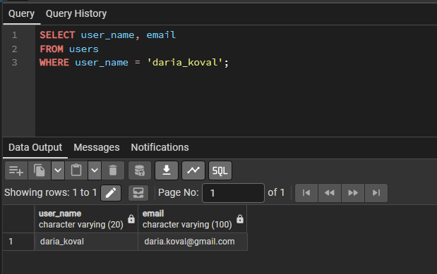
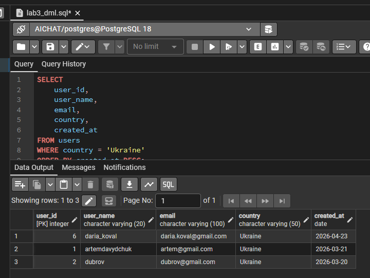
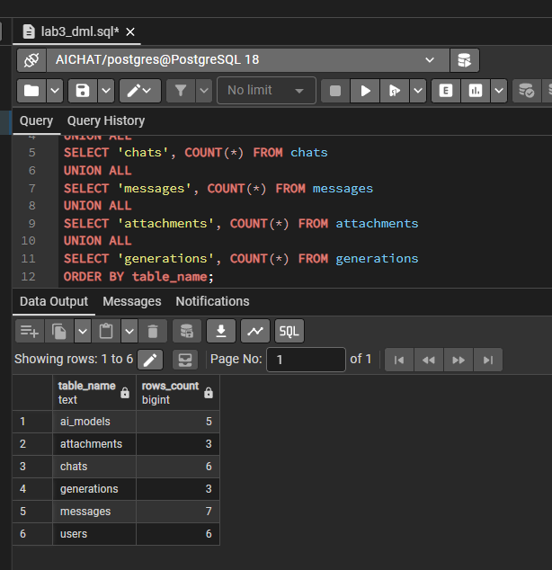
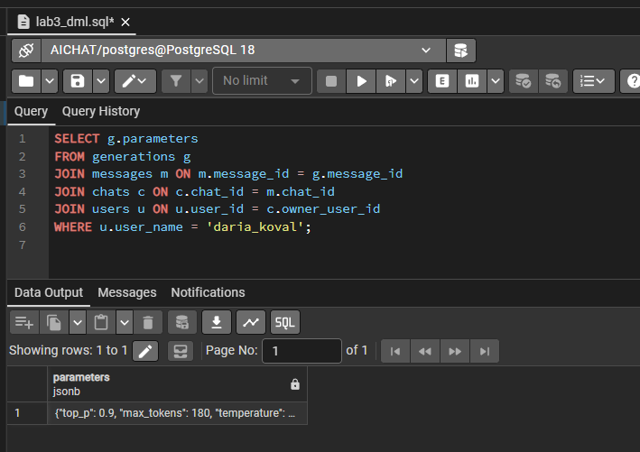

# Лабораторна робота №3

**Тема:** SQL Data Manipulation / OLTP  
**Виконав:** Давидчук Артем, група ІО-41

## Мета роботи

Навчитися виконувати базові OLTP-операції над реляційною базою даних PostgreSQL: вибірку, додавання, оновлення та видалення окремих записів з використанням `SELECT`, `INSERT`, `UPDATE`, `DELETE`.

## Вихідні дані

Для роботи використано базу даних з лабораторної роботи №2. Предметна область - система чатів з моделями штучного інтелекту. Початкова схема містить таблиці:

- `users` - користувачі;
- `ai_models` - моделі ШІ;
- `chats` - чати користувачів;
- `messages` - повідомлення;
- `attachments` - вкладення до повідомлень;
- `generations` - метадані генерації відповіді моделі.

Перед виконанням цієї лабораторної потрібно запустити скрипт `../lab2/db.sql`.

## SQL-скрипт

Основний скрипт роботи збережено у файлі [`lab3_dml.sql`](lab3_dml.sql).

## Опис виконаних запитів

| № | Операція | Мета | Очікуваний результат |
|---|----------|------|----------------------|
| 1 | `SELECT` | Отримати користувачів з України | Повертаються тільки рядки, де `country = 'Ukraine'` |
| 2 | `SELECT` + `JOIN` | Переглянути історію повідомлень у чаті `chat_id = 1` | Виводяться повідомлення чату в хронологічному порядку |
| 3 | `SELECT` + `WHERE` | Знайти вкладення розміром понад 50 KB | Повертаються тільки великі вкладення |
| 4 | `INSERT` | Додати нового користувача, чат, повідомлення, AI-відповідь, генерацію та вкладення | У таблицях з'являються нові пов'язані записи |
| 5 | `SELECT`-перевірка | Перевірити доданий діалог користувача `daria_koval` | Видно два повідомлення: користувача та моделі |
| 6 | `UPDATE` | Змінити назву створеного чату | Назва змінюється на `SQL normalization practice` |
| 7 | `UPDATE` JSONB | Змінити параметр `temperature` у `generations.parameters` | Значення `temperature` змінюється з `0.6` на `0.4` |
| 8 | `DELETE` | Видалити тимчасове вкладення | Видаляється лише файл `normalization_request.txt` |
| 9 | `SELECT`-контроль | Порахувати кількість рядків у таблицях | Показується підсумкова наповненість кожної таблиці |

## Фрагмент DML-сценарію

```sql
WITH new_user AS (
    INSERT INTO users (first_name, second_name, user_name, email, country, created_at)
    VALUES ('Daria', 'Koval', 'daria_koval', 'daria.koval@gmail.com', 'Ukraine', '2026-04-23')
    RETURNING user_id
),
new_chat AS (
    INSERT INTO chats (owner_user_id, title, created_at)
    SELECT user_id, 'Normalization questions', '2026-04-23'
    FROM new_user
    RETURNING chat_id
)
SELECT new_user.user_id, new_chat.chat_id
FROM new_user
JOIN new_chat ON TRUE;
```

У повному скрипті цей підхід продовжується для таблиць `messages`, `generations` та `attachments`. Завдяки `RETURNING` нові ідентифікатори передаються між вставками без ручного вгадування значень `SERIAL`.

## Безпечність змін

Для операцій `UPDATE` та `DELETE` використано умови `WHERE`, які обмежують дію конкретним користувачем `daria_koval` і конкретними записами. Це відповідає OLTP-підходу: змінюються лише окремі рядки, а не вся таблиця.

Приклад безпечного видалення:

```sql
DELETE FROM attachments AS a
USING messages AS m
JOIN chats AS c ON c.chat_id = m.chat_id
JOIN users AS u ON u.user_id = c.owner_user_id
WHERE a.message_id = m.message_id
  AND u.user_name = 'daria_koval'
  AND a.file_name = 'normalization_request.txt';
```

## Результати виконання в pgAdmin

Нижче наведено скріншоти виконання SQL-скрипта та перевірочних запитів у pgAdmin.









## Висновок

У лабораторній роботі виконано основні DML-операції PostgreSQL над схемою з попередньої роботи. Було отримано дані за умовами, додано пов'язаний набір записів, оновлено звичайне поле та JSONB-параметр, а також безпечно видалено один запис з таблиці вкладень. Усі зміни виконуються в межах транзакції та перевіряються контрольними `SELECT`-запитами.