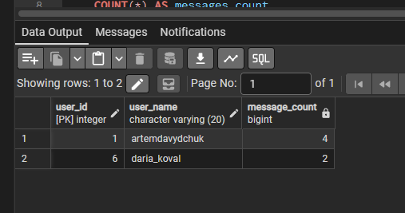
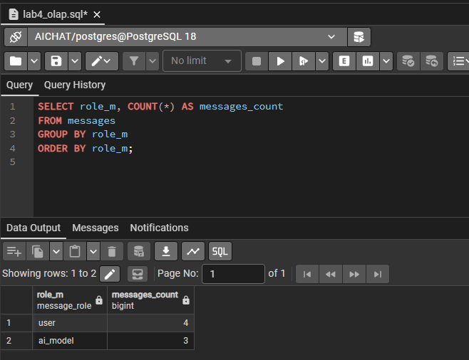
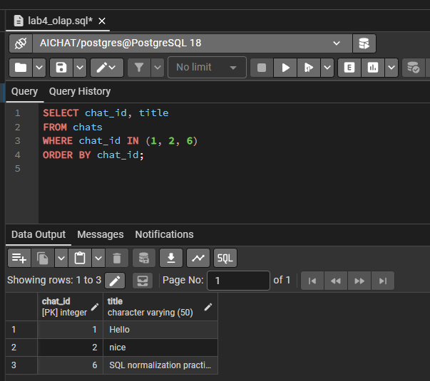
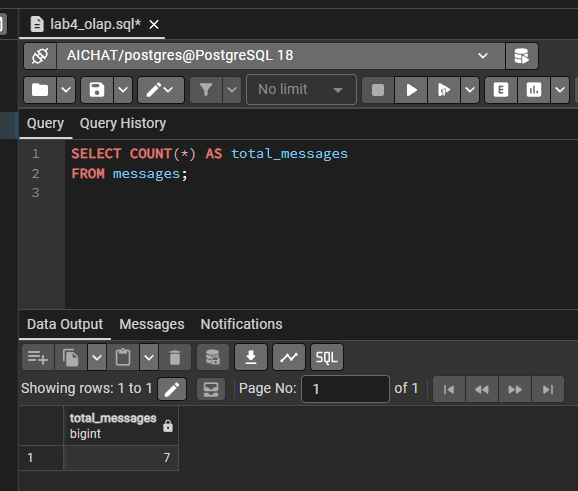

# Лабораторна робота №4

**Тема:** Аналітичні SQL-запити / OLAP  
**Виконав:** Давидчук Артем, група ІО-41

## Мета роботи

Навчитися писати аналітичні SQL-запити до створеної бази даних: використовувати агрегатні функції, `GROUP BY`, `HAVING`, різні типи `JOIN` та підзапити.

## Вихідні дані

Робота базується на схемі з лабораторної №2 та даних, доповнених у лабораторній №3. Перед запуском запитів рекомендовано виконати:

```sql
\i ../lab2/db.sql
\i ../lab3/lab3_dml.sql
```

Основний SQL-файл: [`lab4_olap.sql`](lab4_olap.sql).

## Перелік запитів

| № | Тип | Що робить запит |
|---|-----|-----------------|
| 1 | `COUNT`, `GROUP BY` | Рахує кількість повідомлень за ролями `user` і `ai_model` |
| 2 | `COUNT`, `GROUP BY`, `LEFT JOIN` | Показує кількість чатів і повідомлень за країнами користувачів |
| 3 | `SUM`, `AVG`, `MIN`, `MAX`, `HAVING` | Обчислює статистику вкладень по чатах, де вкладення існують |
| 4 | `AVG`, `MAX`, JSONB | Аналізує параметри генерацій за моделями ШІ |
| 5 | `INNER JOIN` | Виводить історію повідомлень з власниками чатів |
| 6 | `LEFT JOIN` | Виводить усіх користувачів, включно з тими, хто не має чатів |
| 7 | `FULL JOIN` | Показує моделі ШІ та їх генерації, включно з моделями без генерацій |
| 8 | Підзапит у `SELECT` | Для кожного чату показує останнє повідомлення та кількість повідомлень |
| 9 | Підзапит у `WHERE EXISTS` | Знаходить чати, у яких є відповідь моделі GPT |
| 10 | Підзапит у `HAVING` | Знаходить користувачів з кількістю повідомлень вище середньої |

## Приклади аналітичних запитів

### Агрегація за ролями повідомлень

```sql
SELECT
    role_m,
    COUNT(*) AS messages_count
FROM messages
GROUP BY role_m
ORDER BY role_m;
```

Цей запит дозволяє оцінити співвідношення користувацьких повідомлень та відповідей моделі.

### Аналітика генерацій за моделями

```sql
SELECT
    am.model_name,
    am.model_version,
    COUNT(g.generation_id) AS generation_count,
    ROUND(AVG((g.parameters ->> 'temperature')::numeric), 2) AS avg_temperature,
    MAX((g.parameters ->> 'max_tokens')::integer) AS max_tokens_limit
FROM ai_models AS am
LEFT JOIN generations AS g ON g.model_id = am.model_id
GROUP BY am.model_id, am.model_name, am.model_version
HAVING COUNT(g.generation_id) > 0
ORDER BY generation_count DESC, am.model_name, am.model_version;
```

Запит об'єднує таблиці `ai_models` і `generations`, бере значення з JSONB-поля `parameters` та рахує агреговані показники по кожній моделі.

### Підзапит у HAVING

```sql
SELECT
    u.user_id,
    u.user_name,
    COUNT(m.message_id) AS message_count
FROM users AS u
JOIN chats AS c ON c.owner_user_id = u.user_id
JOIN messages AS m ON m.chat_id = c.chat_id
GROUP BY u.user_id, u.user_name
HAVING COUNT(m.message_id) > (
    SELECT AVG(per_user.message_count)
    FROM (
        SELECT COUNT(m2.message_id) AS message_count
        FROM users AS u2
        LEFT JOIN chats AS c2 ON c2.owner_user_id = u2.user_id
        LEFT JOIN messages AS m2 ON m2.chat_id = c2.chat_id
        GROUP BY u2.user_id
    ) AS per_user
);
```

Тут зовнішній запит рахує повідомлення конкретного користувача, а підзапит обчислює середню кількість повідомлень по всіх користувачах.

## Відповідність вимогам

У роботі реалізовано:

- 4 запити з агрегатними функціями `COUNT`, `SUM`, `AVG`, `MIN`, `MAX`;
- групування через `GROUP BY`;
- фільтрацію груп через `HAVING`;
- 3 різні типи об'єднань: `INNER JOIN`, `LEFT JOIN`, `FULL JOIN`;
- 3 запити з підзапитами: у `SELECT`, `WHERE EXISTS` та `HAVING`.

## Результати виконання в pgAdmin

Нижче наведено скріншоти виконання аналітичних запитів та перевірки результатів у pgAdmin.









## Висновок

У лабораторній роботі було виконано набір OLAP-запитів до бази даних чатів з моделями ШІ. Запити дозволяють отримувати статистику повідомлень, вкладень, активності користувачів і використання моделей. На відміну від OLTP-запитів з лабораторної №3, ці запити орієнтовані не на зміну окремих записів, а на аналіз і підсумовування даних.
