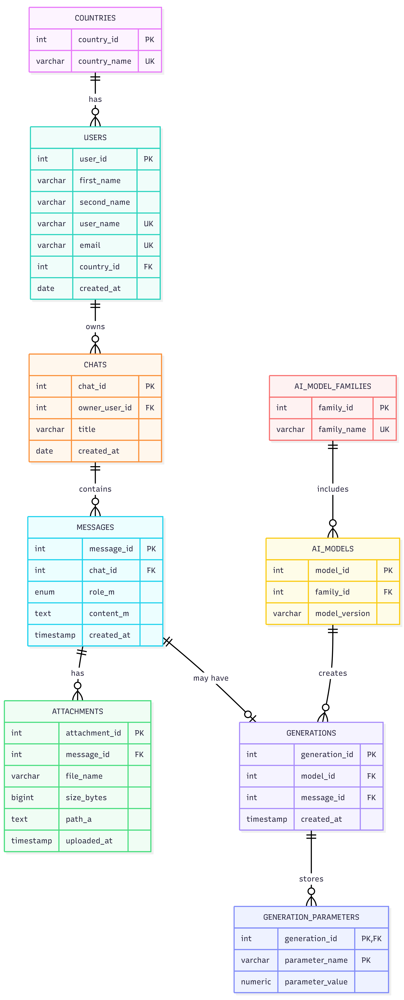
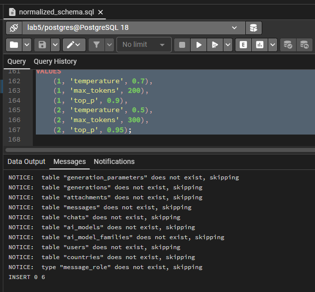
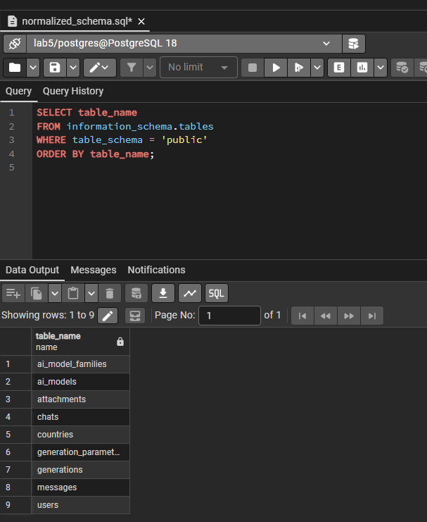
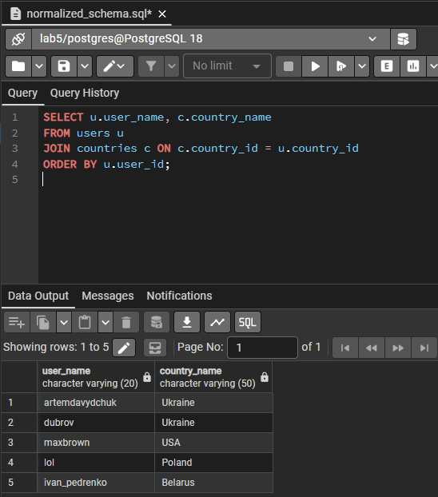
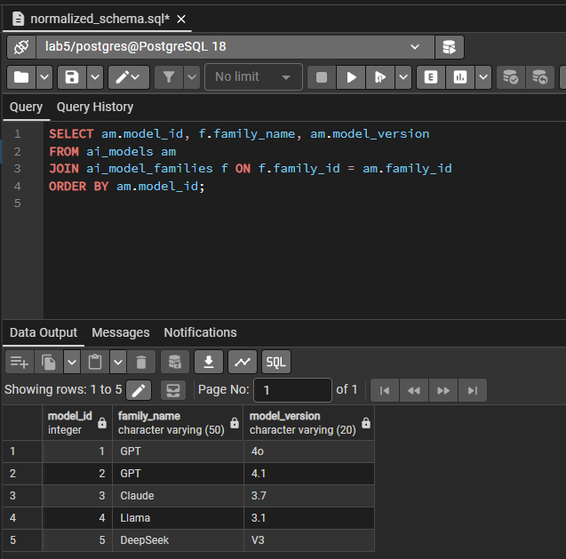
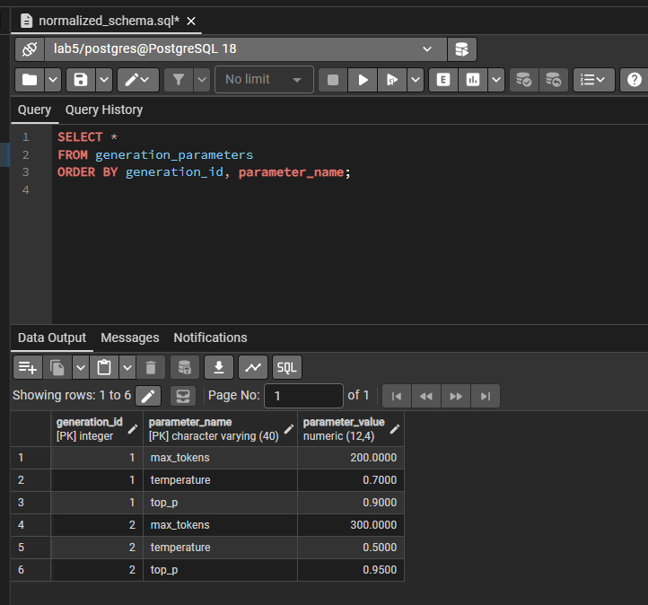
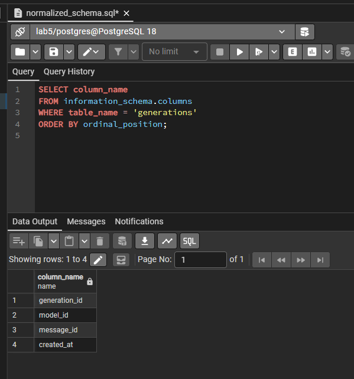

# Лабораторна робота №5

**Тема:** Нормалізація бази даних  
**Виконав:** Давидчук Артем, група ІО-41

## Мета роботи

Проаналізувати схему бази даних з попередніх лабораторних робіт, визначити функціональні залежності, знайти потенційні аномалії та привести схему до третьої нормальної форми.

## Початкова схема

У лабораторній роботі №2 було створено таблиці:

- `users(user_id, first_name, second_name, user_name, email, country, created_at)`;
- `ai_models(model_id, model_name, model_version)`;
- `chats(chat_id, owner_user_id, title, created_at)`;
- `messages(message_id, chat_id, role_m, content_m, created_at)`;
- `attachments(attachment_id, message_id, file_name, size_bytes, path_a, uploaded_at)`;
- `generations(generation_id, model_id, message_id, parameters, created_at)`.

Більшість таблиць уже має коректні первинні та зовнішні ключі. Основна проблема з погляду нормалізації - поле `generations.parameters`, яке зберігає кілька логічних параметрів генерації в одному JSONB-об'єкті.

## Функціональні залежності початкової схеми

| Таблиця | Функціональні залежності |
|---------|--------------------------|
| `users` | `user_id -> first_name, second_name, user_name, email, country, created_at`; `user_name -> user_id`; `email -> user_id` |
| `ai_models` | `model_id -> model_name, model_version`; `(model_name, model_version) -> model_id` як бізнес-ключ |
| `chats` | `chat_id -> owner_user_id, title, created_at` |
| `messages` | `message_id -> chat_id, role_m, content_m, created_at` |
| `attachments` | `attachment_id -> message_id, file_name, size_bytes, path_a, uploaded_at` |
| `generations` | `generation_id -> model_id, message_id, parameters, created_at`; `message_id -> generation_id` через `UNIQUE(message_id)` |

## Виявлені проблеми

1. `generations.parameters` містить одразу кілька фактів: `temperature`, `max_tokens`, `top_p`. У строгій реляційній моделі це неатомарне поле, тому його потрібно винести в окрему таблицю.
2. `users.country` дублює текстові назви країн. Для зменшення ризику різного написання однієї країни доцільно створити довідник `countries`.
3. `ai_models.model_name` повторюється для різних версій однієї сім'ї моделей, наприклад `GPT 4o` і `GPT 4.1`. Для уникнення дублювання назви сімейства створено таблицю `ai_model_families`.

## Нормалізація до 1НФ

Усі поля мають бути атомарними. Для таблиці `generations` поле `parameters` було замінено на окрему таблицю:

```sql
CREATE TABLE generation_parameters (
    generation_id INTEGER NOT NULL REFERENCES generations(generation_id) ON DELETE CASCADE,
    parameter_name VARCHAR(40) NOT NULL,
    parameter_value NUMERIC(12, 4) NOT NULL,
    PRIMARY KEY (generation_id, parameter_name)
);
```

Тепер кожен параметр генерації зберігається окремим рядком:

| generation_id | parameter_name | parameter_value |
|---------------|----------------|-----------------|
| 1 | `temperature` | `0.7` |
| 1 | `max_tokens` | `200` |
| 1 | `top_p` | `0.9` |

## Нормалізація до 2НФ

2НФ вимагає, щоб неключові атрибути залежали від усього ключа, а не від його частини. У більшості таблиць використано прості сурогатні ключі, тому часткові залежності відсутні.

Для нової таблиці `generation_parameters` первинний ключ складений: `(generation_id, parameter_name)`. Єдина неключова колонка `parameter_value` залежить саме від повної пари:

```text
(generation_id, parameter_name) -> parameter_value
```

Окремо `generation_id` не визначає одне значення параметра, бо генерація має багато параметрів. Окремо `parameter_name` також не визначає значення, бо один і той самий параметр має різні значення в різних генераціях.

## Нормалізація до 3НФ

3НФ вимагає відсутності транзитивних залежностей неключових атрибутів від ключа. Для зменшення дублювання довідникові значення винесено в окремі таблиці.

### Країни користувачів

Було:

```text
users(user_id, first_name, second_name, user_name, email, country, created_at)
```

Стало:

```text
countries(country_id, country_name)
users(user_id, first_name, second_name, user_name, email, country_id, created_at)
```

### Сімейства моделей

Було:

```text
ai_models(model_id, model_name, model_version)
```

Стало:

```text
ai_model_families(family_id, family_name)
ai_models(model_id, family_id, model_version)
```

Для `ai_models` додано унікальність пари `(family_id, model_version)`, щоб не можна було двічі створити одну й ту саму версію моделі.

## Фінальна схема 3НФ

Фінальний DDL-скрипт знаходиться у файлі [`normalized_schema.sql`](normalized_schema.sql). Скрипт міграції з початкової схеми lab2 до нормалізованої схеми знаходиться у файлі [`alter_to_3nf.sql`](alter_to_3nf.sql).

Фінальні таблиці:

- `countries(country_id, country_name)`;
- `users(user_id, first_name, second_name, user_name, email, country_id, created_at)`;
- `ai_model_families(family_id, family_name)`;
- `ai_models(model_id, family_id, model_version)`;
- `chats(chat_id, owner_user_id, title, created_at)`;
- `messages(message_id, chat_id, role_m, content_m, created_at)`;
- `attachments(attachment_id, message_id, file_name, size_bytes, path_a, uploaded_at)`;
- `generations(generation_id, model_id, message_id, created_at)`;
- `generation_parameters(generation_id, parameter_name, parameter_value)`.

## ER-діаграма після нормалізації

Зображення ER-діаграми після нормалізації:



## Демонстрація виконання

Нижче наведено скріншоти виконання SQL-скриптів та перевірки нормалізованої схеми.













## Висновок

Початкова схема вже мала правильні ключі та зв'язки, але містила JSONB-поле з кількома параметрами генерації та повторювані текстові довідникові значення. У результаті нормалізації параметри генерацій винесено в окрему таблицю, країни та сімейства моделей - у довідники, а фінальна структура приведена до 3НФ. Це зменшує дублювання даних, спрощує перевірку цілісності та знижує ризик аномалій оновлення.
