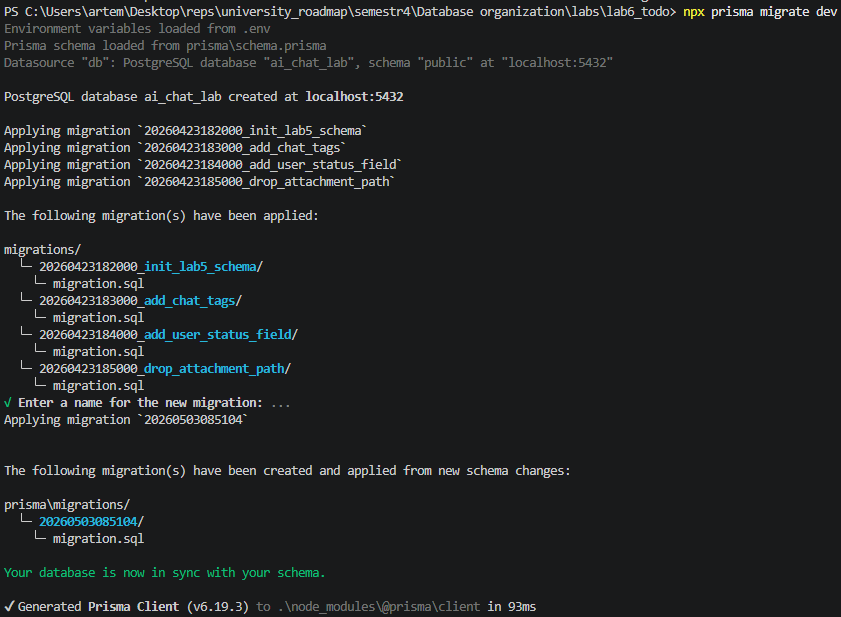
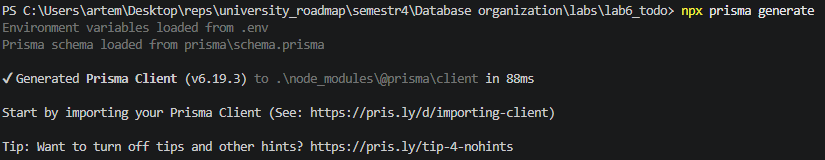
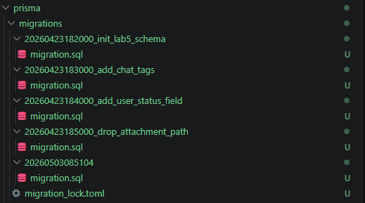
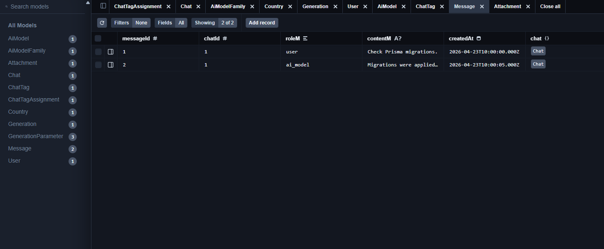

# Лабораторна робота №6

**Тема:** Міграції схем за допомогою Prisma ORM  
**Виконав:** Давидчук Артем, група ІО-41

## Мета роботи

Навчитися керувати змінами схеми PostgreSQL через Prisma ORM: описати схему у `schema.prisma`, створити послідовність міграцій та перевірити фінальну структуру через Prisma Client.

## Структура файлів

- [`package.json`](package.json) - npm-скрипти та залежності Prisma;
- [`.env.example`](.env.example) - приклад `DATABASE_URL`;
- [`prisma/schema.prisma`](prisma/schema.prisma) - фінальна Prisma-модель;
- [`prisma/migrations`](prisma/migrations) - SQL-міграції;
- [`verify.js`](verify.js) - перевірка вставлення та вибірки даних через Prisma Client.

## Команди запуску

```bash
npm install
copy .env.example .env
npx prisma migrate dev
npx prisma generate
npm run verify
```

У файлі `.env` потрібно вказати реальний рядок підключення до PostgreSQL.

## Початкова схема

Початкова міграція `20260423182000_init_lab5_schema` відповідає нормалізованій схемі з лабораторної роботи №5:

```sql
CREATE TABLE generations (
    generation_id SERIAL PRIMARY KEY,
    model_id INTEGER NOT NULL REFERENCES ai_models(model_id),
    message_id INTEGER NOT NULL UNIQUE REFERENCES messages(message_id),
    created_at TIMESTAMP NOT NULL
);

CREATE TABLE generation_parameters (
    generation_id INTEGER NOT NULL REFERENCES generations(generation_id) ON DELETE CASCADE,
    parameter_name VARCHAR(40) NOT NULL,
    parameter_value NUMERIC(12, 4) NOT NULL,
    PRIMARY KEY (generation_id, parameter_name)
);
```

## Міграція 1: додавання тегів чатів

**Файл:** `20260423183000_add_chat_tags/migration.sql`

Додано нову таблицю `chat_tags` і таблицю зв'язку `chat_tag_assignments`. Це дозволяє позначати чати тегами, наприклад `study`, `sql`, `migration-check`.

```sql
CREATE TABLE chat_tags (
    tag_id SERIAL PRIMARY KEY,
    tag_name VARCHAR(40) NOT NULL UNIQUE,
    created_at TIMESTAMP NOT NULL DEFAULT CURRENT_TIMESTAMP
);
```

У Prisma після міграції з'явилися моделі:

```prisma
model ChatTag {
  tagId       Int                 @id @default(autoincrement()) @map("tag_id")
  tagName     String              @unique @map("tag_name") @db.VarChar(40)
  assignments ChatTagAssignment[]
}
```

## Міграція 2: додавання статусу користувача

**Файл:** `20260423184000_add_user_status_field/migration.sql`

До таблиці `users` додано поле `is_active`, яке показує, чи активний обліковий запис користувача.

```sql
ALTER TABLE users
ADD COLUMN is_active BOOLEAN NOT NULL DEFAULT TRUE;
```

Фрагмент моделі Prisma:

```prisma
model User {
  userId   Int     @id @default(autoincrement()) @map("user_id")
  userName String  @unique @map("user_name") @db.VarChar(20)
  isActive Boolean @default(true) @map("is_active")
}
```

## Міграція 3: видалення застарілого поля вкладення

**Файл:** `20260423185000_drop_attachment_path/migration.sql`

З таблиці `attachments` видалено поле `path_a`. Логіка зберігання фізичного шляху до файлу виноситься за межі схеми БД, а в таблиці лишаються метадані вкладення.

```sql
ALTER TABLE attachments
DROP COLUMN path_a;
```

Фінальна модель:

```prisma
model Attachment {
  attachmentId Int      @id @default(autoincrement()) @map("attachment_id")
  messageId    Int      @map("message_id")
  fileName     String   @map("file_name") @db.VarChar(50)
  sizeBytes    BigInt   @map("size_bytes")
  uploadedAt   DateTime @map("uploaded_at") @db.Timestamp(6)
}
```

## Перевірка Prisma Client

Скрипт [`verify.js`](verify.js) виконує такі дії:

1. Створює або знаходить країну `Ukraine`.
2. Створює або оновлює користувача `prisma_tester`.
3. Створює модель GPT 4.1.
4. Створює чат, два повідомлення, вкладення, запис генерації та параметри генерації.
5. Додає тег `migration-check` до чату.
6. Виводить чат з пов'язаними повідомленнями, тегами, моделлю та параметрами.

Очікуваний фрагмент результату:

```text
title: 'Prisma migration check'
userName: 'prisma_tester'
tagName: 'migration-check'
parameterName: 'temperature'
parameterValue: 0.3000
```

Повний вивід команди `npm run verify` збережено у файлі [`media/npm_run_verify.txt`](media/npm_run_verify.txt).

## Скріншоти виконання

Застосування міграцій командою `npx prisma migrate dev`:



Генерація Prisma Client командою `npx prisma generate`:



Створені каталоги міграцій у проєкті:



Перевірка створених даних у Prisma Studio:



## Висновок

У роботі створено Prisma-проєкт для нормалізованої схеми бази даних, додано послідовні міграції, змінено існуючу таблицю, додано нові таблиці та видалено застарілий стовпець. Фінальна схема описана у `schema.prisma`, а працездатність перевіряється через Prisma Client у `verify.js`.
